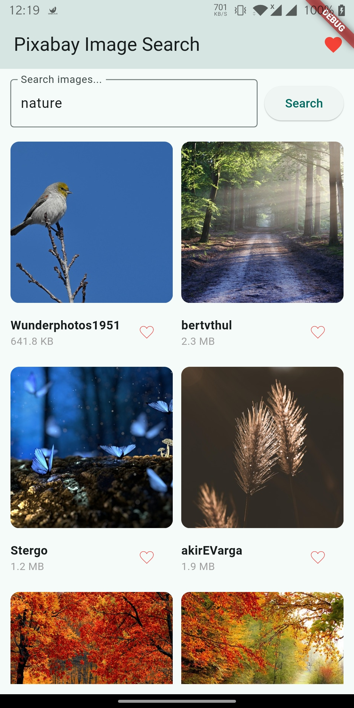
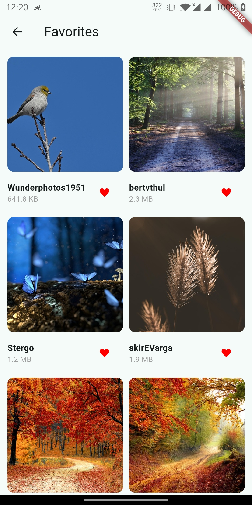

# 🖼️ Pixabay Gallery App

A modern Flutter application to search and showcase images from [Pixabay](https://pixabay.com/).

---

## ✨ Features

- 🔍 **Search** image search using Pixabay API
- ❤️ **Mark favorites** with Lottie animation
- 📁 **Favorites screen** to view favorite images
- 🌀 **Pagination** for seamless infinite scrolling
- 🌗 Clean UI with Material 3 styling
- ✅ Unit tested (API and state)

---

## 📸 Screenshots

<table>
  <tr>
    <td align="center"><strong>🔍 Search Page</strong></td>
    <td align="center"><strong>❤️ Favorites Page</strong></td>
  </tr>
  <tr>
    <td align="center">
      
    </td>
    <td align="center">
      
    </td>
  </tr>
</table>

---

## 🧰 Tech Stack

- **Flutter** (Material 3)
- **HTTP** for making HTTP requests
- **Riverpod** for state management
- **Lottie** for animated icon
- **Pixabay API**
- **DotEnv** for environment configs
- **Mockito / flutter_test** for unit testing

---

## 🔐 Setup

### 1. Clone the project

```bash
git clone https://github.com/sumanrajpathak/pixabay-gallery.git
cd pixabay_gallery
```

### 2. Install dependencies

```bash
flutter pub get
```

### 3. Create `.env` file

```
PIXABAY_API_KEY=your_actual_pixabay_api_key
PIXABAY_API_URL=https://pixabay.com/api/
```

> 🔑 You can [generate an API key here](https://pixabay.com/api/docs/).

### 4. Run the app

```dart
flutter run
```

---

## 🧪 Running Tests

```dart
flutter test
```

> Includes tests for both `ImageNotifier` and `PixabayApi` service.

---

## 📂 Folder Structure

```
lib/
├── models/            # Data models
├── screens/           # UI screens (Search, Favorites)
├── services/          # API services
├── providers/         # Riverpod state management
├── widgets/           # Reusable components
```

---
## 📂 APK Link
[HERE](https://drive.google.com/file/d/1v2Z2woZiD__eYzmjD0WufZ9lCblj3CRl/view?usp=sharing)